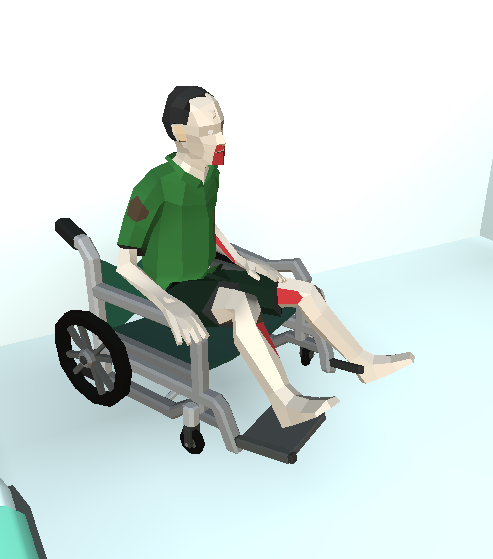
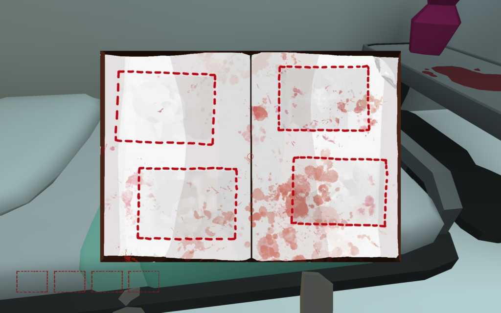
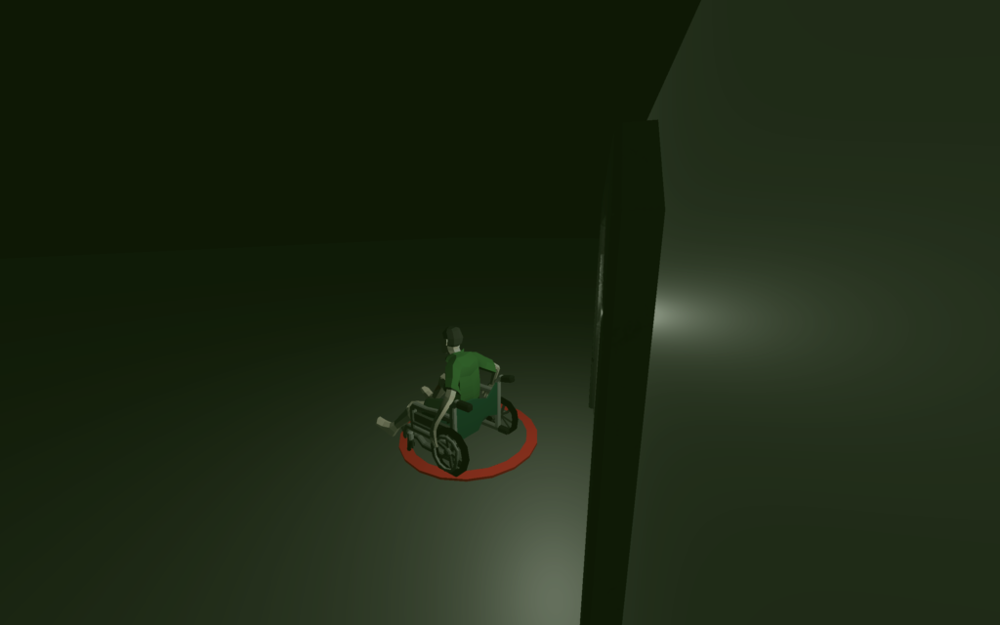
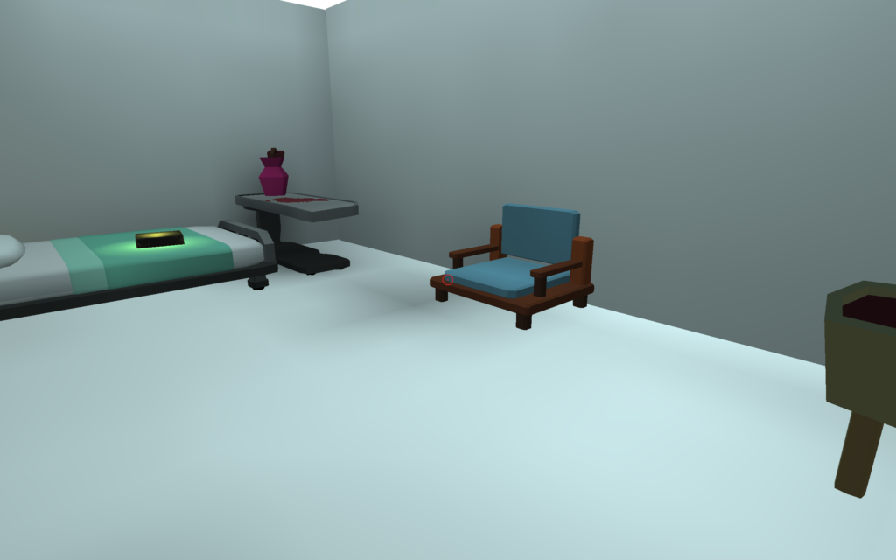
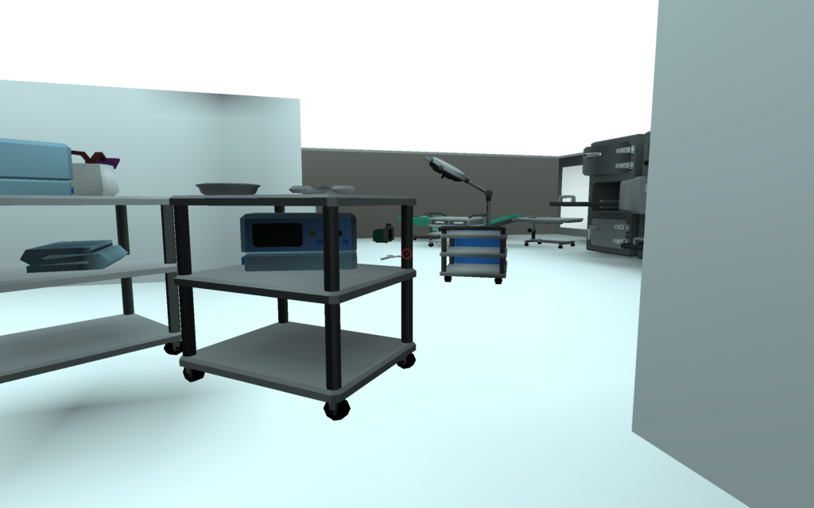
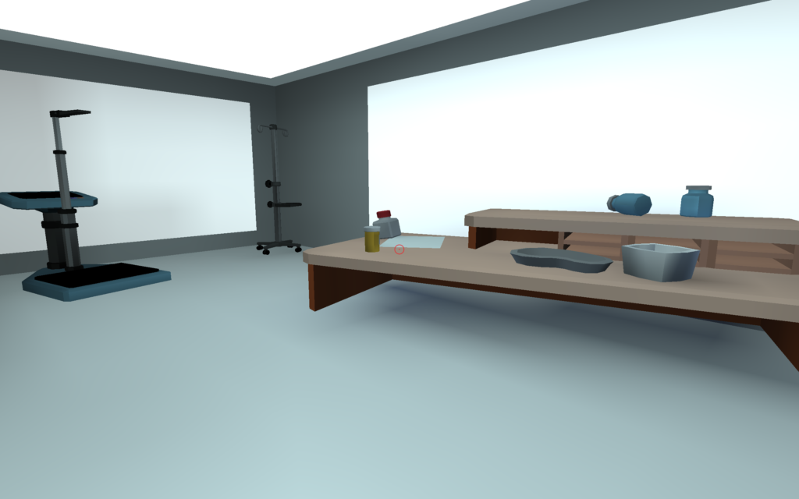
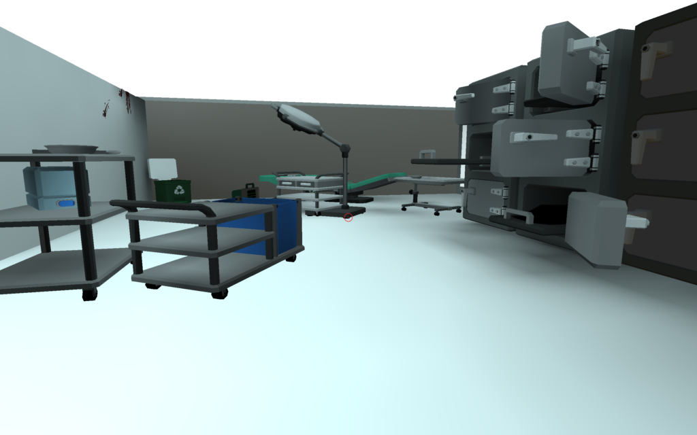
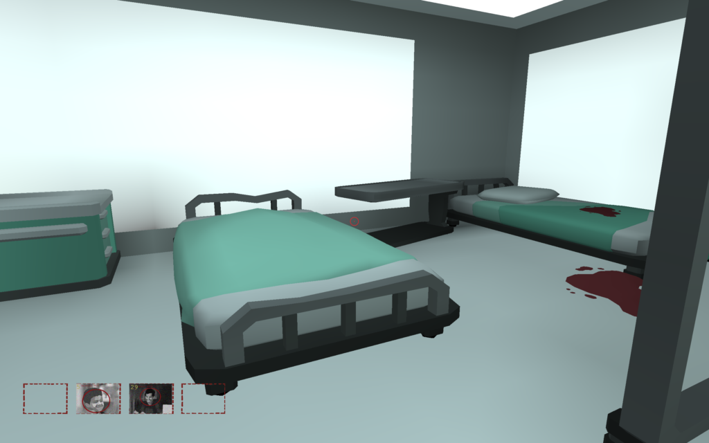
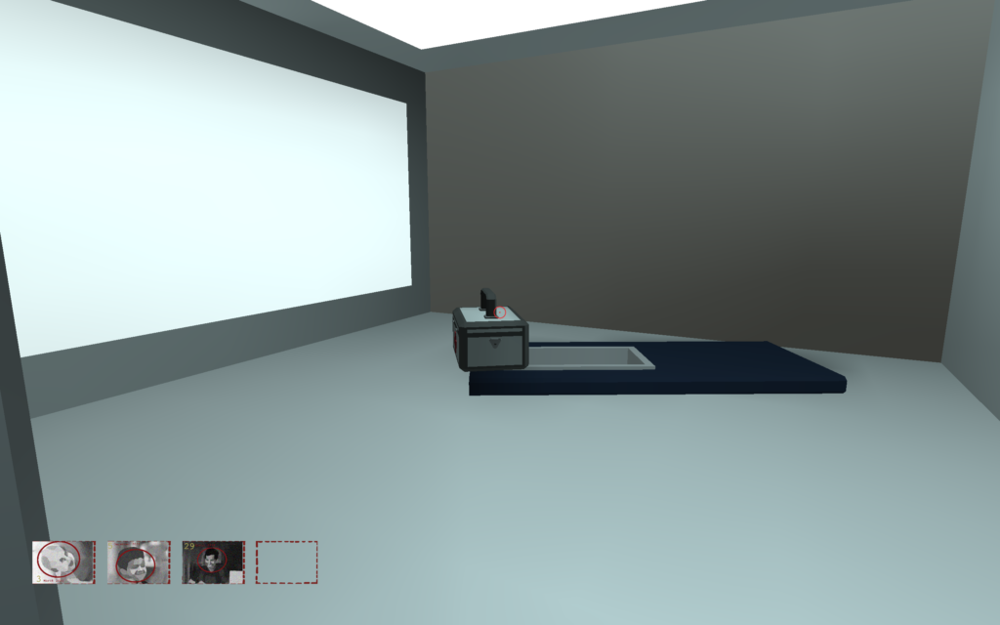
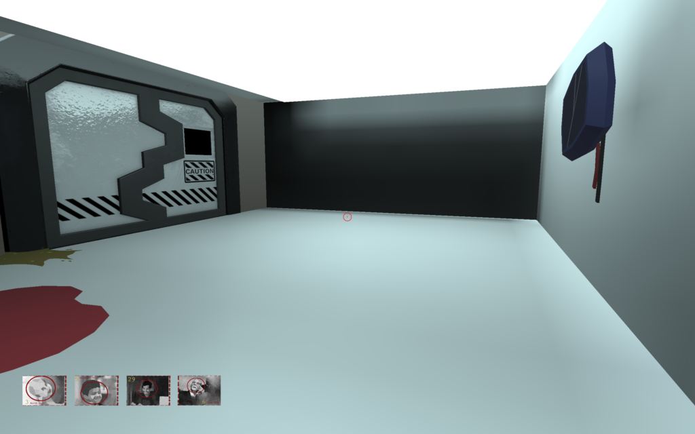

# Watching

### Project Description
This project is an escape room that follows a man in a wheelchair. It was created in Unity. The user is situated in an abandoned hospital that's eerily creepy. As the user tries to escape, the user will find out snippets of the man's past. This project was designed with the constraints of a Google Cardboard in mind. 

### Process
* Character:

The character is a man sitting on a wheelchair. we wanted to create an escape room based off of someone in a wheelchair and the disabilities you would face as you progress. 

* Gameplay:

When the game starts, the user is situated in a room with a glowing book. Once the user clicks on the book, it reveals that there are four things that the user must find. 
 

To move and explore, the user must hold down on the left click. The user must click around to try find where the clues are hidden. Once all clues are gathered, there is a door at the end that asks for a passcode to leave. Once the user leaves the room, a cut scene will appear. 

* Environment:

The original design is based off a mental asylum: we wanted something that was creepy but not gory. As the user progresses with the game, the user will notice that it's completely abandoned and there are multiple blood spotches. The space is divided into a few different areas. Firstly, there is the ward in which you wake up in. There’s a bed next you with an album, a cart blocking your path, a chair, and a sink.

Once you exit, there’s a hallway that connects to the rest of the space.

From there onwards, the user can explore the space and there’s a room on the right side with a table.

If we go forwards from the hallway, we enter the operating room. There’s a bunch of miscellaneous objects, a recycle bin and surgical equipment.

If you turn left, there’s another hallway and it leads to another part of the hospital. If you turn left from that hallway, there is another ward. In this ward, there’s two beds and a drawer.

On the right side from the hallway, there’s an empty room with a box.

The last part of the hospital is the exit where there is a large metal door and a broken screen.

